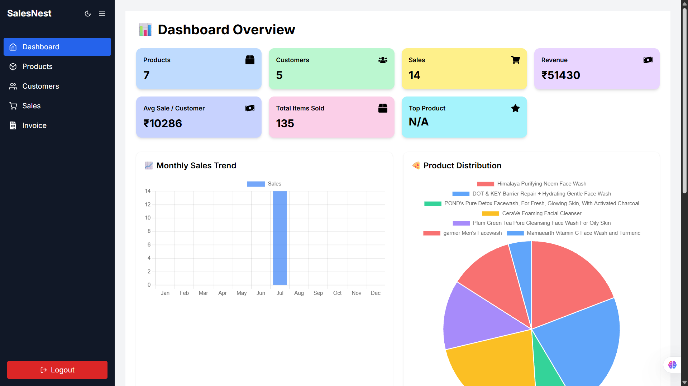

# 📊 SalesNest – Smart Sales Dashboard

SalesNest is a full-stack **Sales Management System** built with the MERN stack that allows users to manage products and orders efficiently, with intuitive analytics like pie charts and detailed statistics.

---

## 🚀 Key Features

- 📦 Manage products – add, edit, delete  
- 🧾 Manage orders – create, view all  
- 🔐 Admin login with JWT-based auth  
- 📊 Visual insights via pie charts (product category-wise)  
- 📈 Real-time stats: Total products, categories & orders  
- 💻 Clean, responsive UI using Tailwind CSS  
- 🔄 Fully API-integrated frontend (live data fetch)

---

## 📸 Dashboard Preview



---

## 🛠️ Tech Stack

- **Frontend:** React.js, Tailwind CSS, Recharts  
- **Backend:** Node.js, Express.js  
- **Database:** MongoDB  
- **Auth & Utilities:** JWT, bcryptjs, Axios, dotenv  

---

## 🔧 Setup Guide

### 1. Clone the Repository

```bash
git clone https://github.com/your-username/salesnest.git
cd salesnest
```

### 2. Install Dependencies

**Frontend**

```bash
cd frontend
npm install
```

**Backend**

```bash
cd backend
npm install
```

### 3. Configure Environment Variables

Create a `.env` file inside the `/backend` directory:

```
PORT=5000
MONGO_URI=your_mongodb_uri
JWT_SECRET=your_secret_key
```

### 4. Start the Project

**Backend**

```bash
cd backend
npm run server
```

**Frontend**

```bash
cd frontend
npm start
```

---

## 📡 API Endpoints

### 🔹 Product APIs

- `GET /api/products` — Fetch all products  
- `POST /api/products` — Add a new product  
- `DELETE /api/products/:id` — Delete product  
- `GET /api/summary/product-distribution` — Pie chart data  

### 🔹 Order APIs

- `GET /api/orders` — Fetch all orders  
- `POST /api/orders` — Add a new order  

---

## 📁 Project Structure

```
salesnest/
├── backend/
│   ├── controllers/
│   ├── models/
│   ├── routes/
│   ├── middleware/
│   └── server.js
├── frontend/
│   ├── components/
│   ├── pages/
│   ├── App.jsx
│   └── main.jsx
```

---

## 👨‍💻 Team

- Mukund – Backend + Dashboard UI  
- [Add team member(s) if needed]

---

## ✅ Future Enhancements

- 📈 Add bar/line charts for sales over time  
- 🧑‍💼 Add user roles and multi-admin access  
- 📤 Export sales reports as CSV  
- 📱 Make mobile-first PWA version

---

## 📄 License

Licensed under the [MIT License](LICENSE).  
Feel free to use, fork, and customize.
