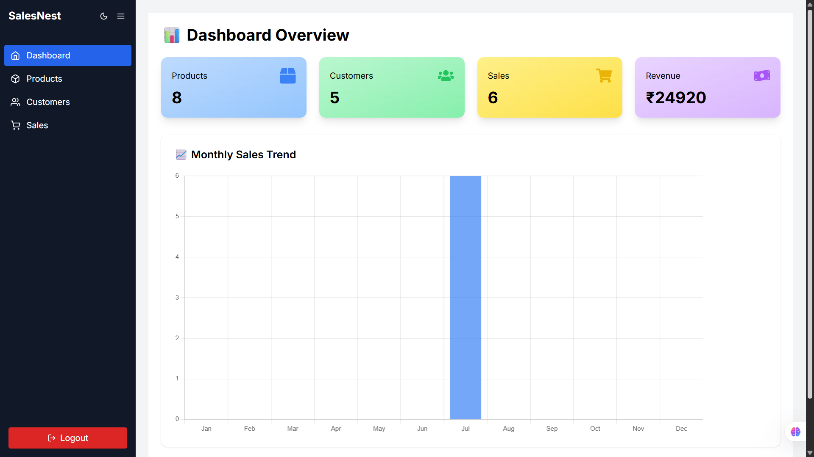

# 🧾 SalesNest

**SalesNest** is a full-stack Sales Management System built with **MERN stack** (MongoDB, Express, React, Node.js). It provides a user-friendly dashboard to manage Products, Customers, and Sales with monthly sales trends and real-time revenue tracking.

---

## 📸 Screenshot



---

## 🚀 Features

- 📦 Add, Edit, Delete Products
- 👥 Manage Customers
- 🛒 Create Sales with Cart Interface
- 📈 Monthly Sales Visualization (Recharts)
- 💰 Revenue Tracking
- 📂 Export Sales as CSV
- 🔐 Protected Routes with Authentication
- 🌙 Dark Mode Compatible

---

## 🔧 Tech Stack

| Frontend         | Backend              | Database     |
|------------------|----------------------|--------------|
| React, TailwindCSS | Node.js, Express.js | MongoDB      |

---

## 🛠️ Setup Instructions

### 1. Clone the repo
```bash
git clone https://github.com/mukundbansal10/SalesNest.git
cd SalesNest
````

### 2. Start Backend

```bash
cd backend
npm install
# Add your .env with MONGODB_URI and PORT
npm start
```

### 3. Start Frontend

```bash
cd ../frontend/my-app
npm install
npm start
```

---

## 🌐 Deployment

* **Frontend**: [Netlify](https://www.netlify.com/)
* **Backend**: [Render](https://render.com/)

Update all `axios` API calls to point to your deployed backend like:

```js
axios.get('https://your-backend-url.onrender.com/api/products')
```

---

## 📁 Folder Structure

```
SalesNest/
├── backend/          → Express + MongoDB backend
├── frontend/
│   └── my-app/       → React frontend app (Tailwind + Chart)
```

---

## 📦 Future Scope

* 🔍 Product search & filter
* 📊 Advanced analytics (daily, weekly, yearly)
* 🧾 Invoice generator
* 👨‍💼 Admin vs Staff roles

---

## 👨‍💻 Developed By

**Mukund Bansal**
B.Tech CSE Student | Passionate Full Stack Developer
📍 Mathura, India
🔗 [LinkedIn](https://linkedin.com/in/mukundbansal10) | [GitHub](https://github.com/mukundbansal10) | [Portfolio](https://mukundbansal.netlify.app)

---

## ⭐ Show your Support

If you like this project, don’t forget to ⭐ the repo!
